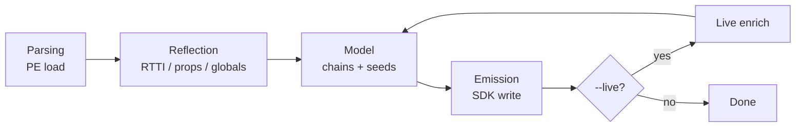

# VuDumper

Hybrid **static + live** SDK dumper for [Vector Unit](https://www.vectorunit.com/) **VuEngine** titles.

It recovers MSVC RTTI classes, `VuProperty` loaders, manager globals, structural layouts, and optional live process validation — then emits a C++ SDK in the spirit of Unreal dumpers (Dumper-7 style), adapted for VuEngine rather than `UObject` / `FProperty`.

> [!NOTE]
> Primary validated target: **Hydro Thunder Hurricane** (`HydroThunder.exe`).

**Docs**

- [Engine access guide](documentation.md) — camera, entities, boats, properties
- Generated SDK — `HydroThunder_sdk/SDK/` after a dump

---

## Table of contents

- [Features](#features)
- [Requirements](#requirements)
- [Build](#build)
- [Usage](#usage)
- [Output layout](#output-layout)
- [Project layout](#project-layout)
- [Pipeline](#pipeline)
- [Target profiles](#target-profiles)
- [How recovery works](#how-recovery-works)
- [Important RVAs](#important-rvas-hydrothunder)
- [Troubleshooting](#troubleshooting)
- [License](#license--intent)

---

## Features

| Area | What it does |
| --- | --- |
| **RTTI scan** | MSVC `.?AV…@@` type descriptors, COL, vftables, inheritance |
| **Property binding** | Property-name strings + loaders → member offsets / kinds |
| **Globals discovery** | Absolute pointer stores + HydroThunder system-init cluster |
| **Engine model** | Pointer chains and structural fields (camera, …) |
| **Live enrich** | Attach to a process, rebind property lists, capture camera angles |
| **Target profiles** | Title-specific layouts only apply when that target is detected |

---

## Requirements

| Item | Notes |
| --- | --- |
| OS | Windows 10 / 11 |
| Toolchain | MSVC (VS 2022+), C++ latest |
| Platform | Prefer **Win32 / x86** for HydroThunder (32-bit PE) |
| Privileges | `--live` benefits from Administrator / `PROCESS_VM_READ` |

---

## Build

```bat
msbuild Dumper.vcxproj /p:Configuration=Release /p:Platform=x86
```

Typical output:

```text
build/Dumper/Release/Dumper.exe
```

---

## Usage

```text
Dumper.exe --help
Dumper.exe --live [ProcessName.exe] [out_dir]
Dumper.exe <exe_path> [out_dir]
Dumper.exe <exe_path> [out_dir] --live [ProcessName.exe]
```

### Examples

**Static dump from disk**

```bat
Dumper.exe "D:\Games\HydroThunder\HydroThunder.exe" ".\HydroThunder_sdk"
```

**Live attach** (image path is taken from the running process)

```bat
Dumper.exe --live HydroThunder.exe ".\HydroThunder_sdk"
```

**Static parse + live enrich**

```bat
Dumper.exe ".\HydroThunder.exe" ".\HydroThunder_sdk" --live HydroThunder.exe
```

> [!TIP]
> If `--live` is passed without a process name and the HydroThunder profile is detected, the default process is `HydroThunder.exe`.

---

## Output layout

Given `out_dir` (for example `HydroThunder_sdk`):

```text
out_dir/
├── dump_summary.txt       # human summary, chains, live camera angles
├── live_snapshot.txt      # only with --live
├── sdk.json               # machine-readable dump
└── SDK/
    ├── types.hpp          # VuVector2/3, VuMatrix4, VuRect, …
    ├── classes.hpp        # c_Vu* class layouts
    ├── engine_offsets.hpp # Globals / Fields / Chains
    └── orphan_loaders.hpp # unbound property loaders
```

### Consuming the SDK

```cpp
#include "SDK/types.hpp"
#include "SDK/classes.hpp"
#include "SDK/engine_offsets.hpp"

using namespace Vu::SDK;
using namespace Vu::SDK::Engine;

auto* viewport = *reinterpret_cast<c_VuViewportManager**>(
    module_base + Globals::g_vu_viewport_manager);

auto* camera = reinterpret_cast<std::uint8_t*>(viewport)
    + Fields::VuViewportManager_Camera; // +0x28 for viewport 0

float eye[3]{};
std::memcpy(eye, camera + Fields::VuCamera_EyePosition, sizeof(eye));
```

Prefer the pointer chains in [`documentation.md`](documentation.md) and `engine_offsets.hpp` over hard-coded guesses.

---

## Project layout

```text
Dumper/
├── main.cxx
├── README.md
├── documentation.md
├── impl/
│   ├── includes.hxx
│   └── include/hexrays/…
└── workspace/
    ├── utility/           # logger, common, target profile
    └── core/
        ├── parsing/       # PE image + dump types
        ├── reflection/    # RTTI, properties, globals
        ├── model/         # chains / structural seeds
        ├── live/          # process attach + live rebind
        ├── emission/      # SDK / summary / JSON writers
        └── dumper.hxx     # orchestrator
```

---

## Pipeline



1. **Parsing** — load PE  
2. **Reflection** — RTTI → properties → globals  
3. **Model** — label globals, seed structural layouts, build chains  
4. **Emission** — write SDK  
5. **Live** (optional) — enrich, rebuild model, re-emit  

---

## Target profiles

Detection lives in [`workspace/utility/target.hxx`](workspace/utility/target.hxx) and uses the image stem and/or process name:

| Name contains | Profile |
| --- | --- |
| `hydrothunder` / `hydro_thunder` | `hydro_thunder` |
| otherwise | `unknown` / generic |

### HydroThunder-only (gated)

These run only when `is_hydro_thunder(target)` is true:

- System-init singleton cluster scan (`sub_4024E0`)
- Known manager RVAs (`g_vu_viewport_manager`, boat manager, entity repo, …)
- `VuViewportManager` / `VuCamera` structural field seeds
- Live camera angle capture
- Camera pointer-chain emission with HT layout constants

Generic VuEngine titles still get RTTI + property-loader recovery when those patterns exist.

---

## How recovery works

### RTTI

Walks MSVC RTTI: type descriptor strings → Complete Object Locator → vftable → base classes. Emits `c_<ClassName>` with inheritance notes.

### Properties

Vu entities/components register named properties via loaders that write into `this + offset`. The dumper binds string names to offsets and infers kinds (`float`, vector, asset, …). Unbound loaders land in `orphan_loaders.hpp`.

### Globals

Finds data-section stores of object pointers near vftable immediates. With live attach, vftable identity can refine class names on singleton slots.

### Live

With `--live`:

- Opens the process and resolves the module base  
- Walks the entity repository / boat manager when present  
- Rebinds property lists (`value_ptr - owner = offset`)  
- For HydroThunder: reads viewport cameras and writes yaw / pitch / roll into `dump_summary.txt`  

> [!IMPORTANT]
> Camera basis is **Z-up** (horizontal plane = XY). See [documentation.md](documentation.md#44-coordinate-system).

---

## Important RVAs (HydroThunder)

Preferred image base VA: `0x400000`.  
RVAs are relative to the **live** module base.

| Symbol | RVA | Class |
| --- | --- | --- |
| `g_vu_boat_manager` | `0x358FB8` | `VuBoatManager` |
| `g_vu_viewport_manager` | `0x359060` | `VuViewportManager` |
| `g_vu_entity_repository` | `0x359080` | `VuEntityRepositoryImpl` |
| `get_property` (helper) | `0x4FBDF0` | — |

Re-check `SDK/engine_offsets.hpp` after every fresh dump — live enrichment can add more fields.

---

## Troubleshooting

| Symptom | Likely cause |
| --- | --- |
| `process not found` | Game not running, or wrong `--live` name |
| `OpenProcess failed` | Need elevation / protected process |
| Empty `VuViewportManager` without camera fields | Not HydroThunder profile, or model seed skipped |
| Sparse entity / transform fields | Run with `--live` so property lists rebind |
| Wrong camera angles | Use Z-up math; refresh with `--live` while in-game |

---

## License / intent

This tool is for reverse-engineering and research on VuEngine binaries you own. It is **not** affiliated with Vector Unit or the Hydro Thunder rights holders.
