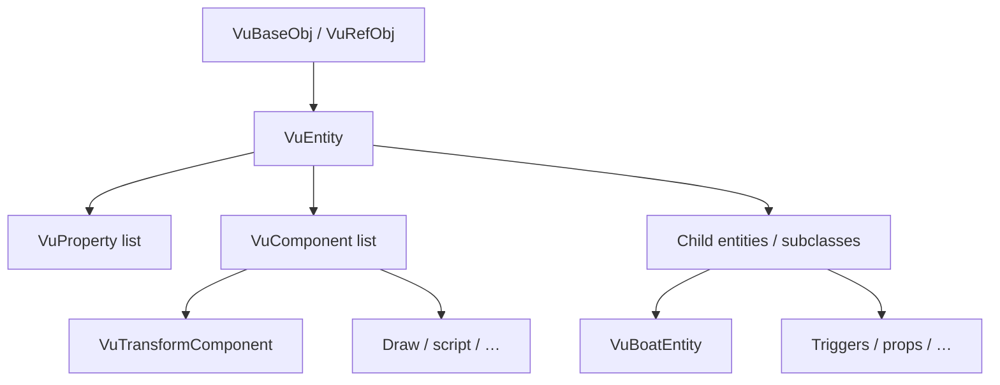
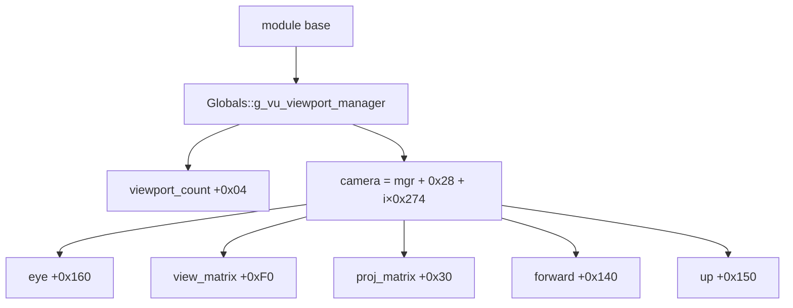

# Vector Unit (VuEngine) — Access Documentation

Practical reference for reading **camera**, **entities**, **boats**, and related systems in Vector Unit’s C++ engine (**VuEngine**), recovered from **Hydro Thunder Remastered** (`HydroThunder.exe`, 32-bit).

**Related**

- [VuDumper README](README.md) — build & run the dumper  
- `HydroThunder_sdk/dump_summary.txt` — latest chains + live camera angles  
- `HydroThunder_sdk/SDK/engine_offsets.hpp` — generated globals / fields / chains  

---

## Table of contents

- [1. Engine overview](#1-engine-overview)
- [2. Addressing model](#2-addressing-model)
- [3. Key globals](#3-key-globals-hydrothunder)
- [4. Camera](#4-camera)
- [5. Entities](#5-entities)
- [6. Boats](#6-boats-hydrothunder)
- [7. Properties](#7-properties-vuproperty)
- [8. Math types](#8-math-types-sdktypeshpp)
- [9. RTTI quick checks](#9-rtti-quick-checks)
- [10. System component map](#10-system-component-map-subset)
- [11. Workflow](#11-workflow-recommendations)
- [12. Quick reference](#12-quick-reference-card)

---

## 1. Engine overview

VuEngine core ideas:

| Concept | VuEngine analogue |
| --- | --- |
| Object identity | MSVC RTTI (`.?AVVuEntity@@`, …) + vftables |
| Game objects | `VuEntity` (+ components) |
| Tunables / serialization | `VuProperty` linked lists + typed loaders |
| Singletons | `Vu*Manager` / `Vu*Impl` globals in `.data` |
| Math | `VuVector2` / `VuVector3`, `VuMatrix4`, `VuRect`, `VuColor` |

### Object hierarchy



```text
VuBaseObj / VuRefObj
└── VuEntity
    ├── VuProperty list
    ├── VuComponent list   (VuTransformComponent, draw, script, …)
    └── child entities / game subclasses
        (VuBoatEntity, triggers, props, …)
```

System services (`VuViewportManager`, `VuBoatManager`, `VuEntityRepositoryImpl`, …) inherit `VuSystemComponent` and live as process globals.

---

## 2. Addressing model

```text
live_module_base = GetModuleHandle / tool-discovered base
*global          = read_ptr(live_module_base + Globals::g_…)
```

| Item | Notes |
| --- | --- |
| Preferred PE load address | Often `0x400000` for this title in IDA — **not** guaranteed at runtime |
| Pointer size | 32-bit (`sizeof(void*) == 4`) |
| Global RVAs | Only from `SDK/engine_offsets.hpp` after a dump |

> [!IMPORTANT]
> At runtime, always add the **actual** module base. Never hard-code absolute RVAs from this guide or an old dump.

---

## 3. Key globals (HydroThunder)

Symbols emitted under `Vu::SDK::Engine::Globals` (values come from your dump):

| Name | Type |
| --- | --- |
| `g_vu_boat_manager` | `VuBoatManager*` |
| `g_vu_project_manager` | `VuProjectManager*` |
| `g_vu_game_mode_manager` | `VuGameModeManagerImpl*` |
| `g_vu_dev_menu` | `VuDevMenu*` |
| `g_vu_viewport_manager` | `VuViewportManager*` |
| `g_vu_entity_repository` | `VuEntityRepositoryImpl*` |

```cpp
using namespace Vu::SDK::Engine;

auto* mgr = *reinterpret_cast<T**>(module_base + Globals::g_vu_viewport_manager);
if (!mgr)
    return; // not constructed yet (menu / early boot)
```

---

## 4. Camera

### 4.1 Where it lives

Cameras are **not** separate heap objects from a virtual `getCamera`.  
`VuViewportManager` embeds up to **4** viewport slots; each slot contains an embedded **`VuCamera`** blob.

| Constant | Value | Meaning |
| --- | --- | --- |
| Manager size | `0x9D8` | `operator new` in factory |
| `ViewportCount` | `+0x04` | active viewport count (1–4) |
| Viewport / camera stride | `0x274` (628) | bytes between cameras |
| `getCamera(0)` | `+0x28` | start of camera 0 |
| Camera size | `0x240` | memcpy’d as a unit in game code |

```text
camera_i = viewport_manager + 0x28 + i * 0x274
```

Absolute eye for camera 0 on the manager: **`manager + 0x188`** (`0x28 + 0x160`). Prefer `Fields::` names from the SDK when present.

### 4.2 Pointer trace



```text
module
  → [0] Globals::g_vu_viewport_manager
  → [1] viewport_count            +0x04
  → [2] camera                    +0x28 + i*0x274
  → [3] eye                       camera + 0x160
  → [4] view_matrix               camera + 0xF0
  → [5] proj_matrix               camera + 0x30
  → [6] forward                   camera + 0x140
  → [7] up                        camera + 0x150
```

### 4.3 `VuCamera` fields

Offsets are relative to the camera base (`manager + 0x28 + i * 0x274`).

| Field | Offset | Type | Notes |
| --- | --- | --- | --- |
| Velocity | `0x20` | `VuVector3` | FMOD listener velocity |
| ProjMatrix | `0x30` | `VuMatrix4` | perspective / ortho |
| ViewMatrix | `0xF0` | `VuMatrix4` | view / world transform region |
| Forward | `0x140` | `VuVector3` | look direction |
| Up | `0x150` | `VuVector3` | ≈ `(0, 0, 1)` when level |
| EyePosition | `0x160` | `VuVector3` | world eye / FMOD listener pos |

`VuVector3` storage is **16 bytes** (`x, y, z, pad`) in property / copy paths.

### 4.4 Coordinate system

HydroThunder camera / audio listener basis is **Z-up**:

| Axis | Role |
| --- | --- |
| **XY** | Horizontal plane |
| **Z** | Up |

| Angle | Formula |
| --- | --- |
| Yaw | `atan2(forward.y, forward.x)` (degrees) |
| Pitch | `atan2(forward.z, length(forward.xy))` |
| Roll | angle of `up` vs world-up `(0, 0, 1)` about `forward` |

Live dumps (`Dumper.exe --live`) write current angles into `dump_summary.txt` under `live_camera_angles:`.

### 4.5 Example (viewport 0)

```cpp
using namespace Vu::SDK::Engine;

auto* vpm = *reinterpret_cast<std::uint8_t**>(
    module_base + Globals::g_vu_viewport_manager);
if (!vpm)
    return;

const int count = *reinterpret_cast<int*>(
    vpm + Fields::VuViewportManager_ViewportCount);

std::uint8_t* cam = vpm + Fields::VuViewportManager_Camera; // i = 0

struct Vec3 { float x, y, z, pad; };
auto eye = *reinterpret_cast<Vec3*>(cam + Fields::VuCamera_EyePosition);
auto fwd = *reinterpret_cast<Vec3*>(cam + Fields::VuCamera_Forward);
auto up  = *reinterpret_cast<Vec3*>(cam + Fields::VuCamera_Up);
```

Split-screen: iterate `i` in `[0, count)` with stride `0x274`.

### 4.6 Related camera systems

Entities can **drive** the camera (frontend / boat chase / debug), for example:

- `VuFrontEndCameraEntity`, `VuSetFrontEndCameraEntity`
- `VuActiveCameraTriggerEntity`
- Debug camera menu strings (`DebugCamera`, …)

Those typically `memcpy` `0x240` bytes into `manager + 0x28`.  
For “what is on screen now”, always read the **viewport manager** camera.

---

## 5. Entities

### 5.1 Repository singleton

```text
Globals::g_vu_entity_repository  →  VuEntityRepositoryImpl*
```

Live enrichment recovers (when present):

| Field | Typical offset | Meaning |
| --- | --- | --- |
| `buckets` | `+0x0C` | array of list heads |
| `entity_count` | nearby | total entities |

Walk pattern:

```text
repo → buckets[i] → entity → entity + bucket_next → …
```

### 5.2 `VuEntity` layout (live-validated)

Prefer a `--live` dump. Common HydroThunder values:

| Field | Offset | Type |
| --- | --- | --- |
| Name hash | `+0x30` | `int` (FNV-ish; low 8 bits → bucket) |
| Properties head | `+0x44` | `VuProperty*` |
| Component list head | `+0x48` | `VuComponent*` |
| Transform | `+0x50` | `VuTransformComponent*` |
| Bucket prev | `+0x54` | `VuEntity*` |
| Bucket next | `+0x58` | `VuEntity*` |

> [!WARNING]
> Static-only dumps may show incomplete or misleading entity fields until live rebind runs.

### 5.3 Components

`VuComponent` nodes form a linked list (`next` commonly at `+0x0C` after live discovery).  
`VuTransformComponent` is created for most world entities and pointed by `entity + 0x50`.

| Transform field | Offset | Notes |
| --- | --- | --- |
| Position | `+0x40` | translation |
| Scale | `+0xB0` | scale vector |

**World position chain**

```text
module
  → Globals::g_vu_entity_repository
  → buckets / entities
  → entity + 0x50  → VuTransformComponent*
  → transform + 0x40 → position
```

### 5.4 Example: iterate entities

```cpp
using namespace Vu::SDK::Engine;

auto* repo = *reinterpret_cast<std::uint8_t**>(
    module_base + Globals::g_vu_entity_repository);
auto* buckets = *reinterpret_cast<std::uint32_t**>(repo + 0x0C);

for (int b = 0; b < 256; ++b) {
    for (std::uint32_t e = buckets[b]; e; ) {
        auto* ent = reinterpret_cast<std::uint8_t*>(e);
        auto* xf = *reinterpret_cast<std::uint8_t**>(ent + 0x50);
        if (xf) {
            float pos[3];
            std::memcpy(pos, xf + 0x40, 12);
            // use pos…
        }
        e = *reinterpret_cast<std::uint32_t*>(ent + 0x58); // bucket_next
    }
}
```

Validate `buckets` / `next` against your latest `engine_offsets.hpp` / live snapshot.

---

## 6. Boats (HydroThunder)

### 6.1 Manager

```text
Globals::g_vu_boat_manager  →  VuBoatManager*
```

| Field | Offset | Meaning |
| --- | --- | --- |
| `boats_data` | `+0x0C` | `VuBoatEntity**` array |
| `boats_count` | `+0x10` | count |

### 6.2 Pointer trace

```text
module
  → Globals::g_vu_boat_manager
  → boats_data[i]          VuBoatEntity*
  → (+0x50) transform      VuTransformComponent*
  → (+0x40) position
```

`VuBoatEntity` also exposes gameplay properties via loaders (`InitialBoostEnergy`, engine params, …). Those appear in `classes.hpp` when loaders / live bind successfully.

---

## 7. Properties (`VuProperty`)

Entities and components expose a linked list of properties used for project data and runtime tweaks.

Typical node layout (HydroThunder):

| Field | Offset |
| --- | --- |
| Name string pointer | `+0x04` |
| Next property | `+0x10` |
| Value pointer | `+0x34` |

```text
member_offset = value_ptr - owner_ptr
```

Kinds are inferred from loader templates / tags (`int`, `bool`, `string`, `VuVector3`, `VuRect`, assets, …).

Live mode walks these lists to fix offsets that static analysis alone leaves at `+0` or unbound. Helper function addresses belong in your dump / IDA DB — do not hard-code them from docs.

---

## 8. Math types (`SDK/types.hpp`)

| Type | Size | Layout |
| --- | --- | --- |
| `VuVector2` | 8 | `x, y` |
| `VuVector3` | 16 | `x, y, z, pad` |
| `VuColor` | 4 | `r, g, b, a` |
| `VuRect` | 16 | `left, top, right, bottom` |
| `VuMatrix4` | 64 | 4×4 floats |

Treat camera matrices as opaque `VuMatrix4` blobs unless you verify row/column convention against a known look-at.

---

## 9. RTTI quick checks

Useful when validating a live pointer:

1. Read vftable at `object + 0`
2. COL is often at `vftable - 4`
3. Type descriptor inside COL → mangled name (`.?AVVuBoatEntity@@`)

The dumper maps vftable → class for emitted `c_*` types.

---

## 10. System component map (subset)

Resolve each via `Globals::` in `engine_offsets.hpp` after a dump:

| Global symbol | Class | Role |
| --- | --- | --- |
| `g_vu_boat_manager` | `VuBoatManager` | Race boats array |
| `g_vu_project_manager` | `VuProjectManager` | Project / level load |
| `g_vu_game_mode_manager` | `VuGameModeManagerImpl` | Game mode stack |
| `g_vu_draw_manager` / draw impl | `VuDrawManagerImpl` | Draw submission |
| `g_vu_viewport_manager` | `VuViewportManager` | Viewports + cameras |
| `g_vu_gfx_sort` / related | `VuGfxSort` | Sort / pass state |
| `g_vu_entity_repository` | `VuEntityRepositoryImpl` | World entity buckets |
| `g_vu_entity_factory` / related | `VuEntityFactory` | Entity construction |

Exact symbol names may vary slightly with dump labeling — match class names in `dump_summary.txt` / `engine_offsets.hpp`.

---

## 11. Workflow recommendations

1. Run a **static** dump for RTTI + loaders + globals.  
2. Run **`--live` in-game** (not only the main menu) to rebind transforms / boat fields and snapshot camera angles.  
3. Consume **`engine_offsets.hpp`** and **`Chains`** — never paste absolute RVAs into client code.  
4. Treat HydroThunder structural camera offsets as **title-specific** unless re-verified on another VuEngine binary.

---

## 12. Quick reference card

```text
Camera (viewport 0)
──────────────────
*(VuViewportManager*)(base + Globals::g_vu_viewport_manager)
  + 0x28              → VuCamera
  + 0x28 + 0x160      → eye (Z-up world)
  + 0x28 + 0x140      → forward
  + 0x28 + 0x150      → up
  + 0x28 + 0xF0       → view matrix
  + 0x28 + 0x30       → proj matrix

Entities
────────
*(VuEntityRepositoryImpl*)(base + Globals::g_vu_entity_repository)
  + 0x0C              → buckets
  entity + 0x50       → VuTransformComponent*
  transform + 0x40    → position

Boats
─────
*(VuBoatManager*)(base + Globals::g_vu_boat_manager)
  + 0x0C / +0x10      → data / count
  boat + 0x50         → transform → +0x40 position
```
